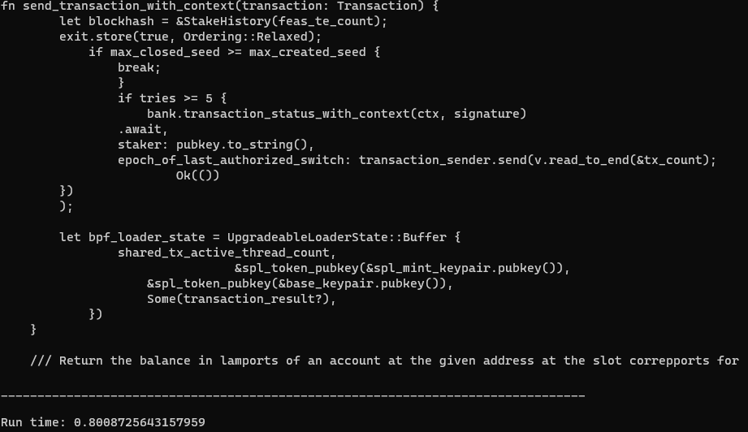

# AI
Тема: генерация текста на основе RNN (рекурентной нейронной сети), а именно Rust кода.

Ушаков Андрей РИС-19-1б, Шеретов Марк АСУ-19-1б

Репозиторий содержит:
1) Jupiter notebook, 
2) код для тренировки (train.py) 
3) Генератор текста (generator.py)
4) Модель (256 эпох)

Пример генерации (30 эпох на основе 200 000 символов кода)

Пример генерации (256 эпох на основе 200 000 символов кода)

